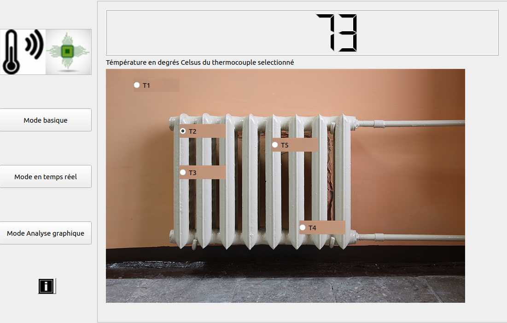
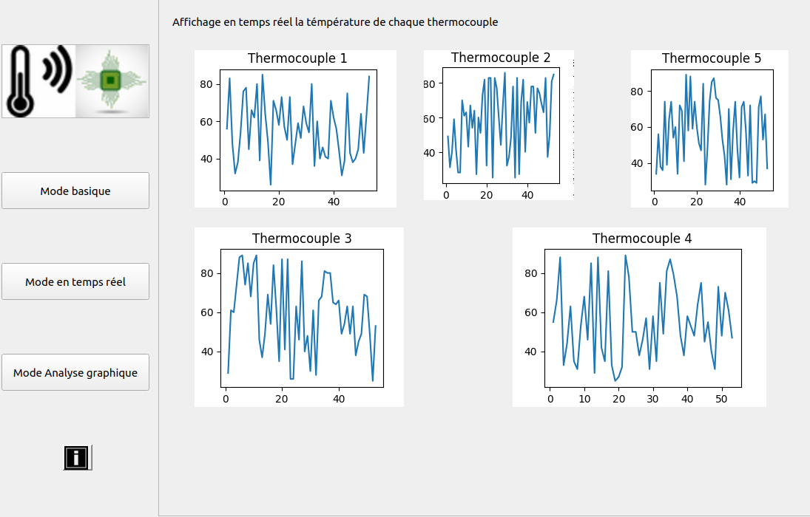

# Installation des librairies & packages : 
> pip install -r requirements.txt 

# Commande d'exécution : 
> python3 mainwindow.py. 

# Utilisation du logiciel

## Qu'est ce que c'est ?

> Lire le PDF : sujet.pdf

> Ce logiciel est une interface Homme machine (IHM). Cette derniére permet d'afficher les données envoyés par les thermocouples bronchés sur la ventirade d'un pc.

> Pour pouvoir utilisé cet IHM comme décrit ci-haut, il faut obligatoirement avoir une carte nuclé et un thermocouple

## Utilisation actuelle

> On peut utiliser cet IHM pour facilement afficher les données aléatoires dans des grapgs en utilisant les bibliotéques matplotlib et random.

# Images IHM 

